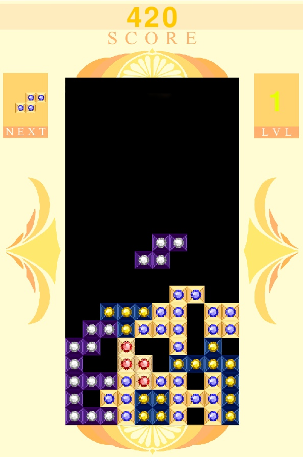

                                        Красивый тетрис
                                               Ответственный за программный код -
							           Александр Зубаль
				                   Ответственный за изображения -
                                                               Кожина Алиса
В проекте сосздан собственный "Тетрис", с переработанными текстурами. Суть игры не отличается от оригинала: 
есть поле 10х20, сверху переодически падают фигуры из 4 блоков,которые надо укоплектовать как можно компактнее, 
для этого их можно крутить и перемещать. Если одна из линий полностью заполнена, то она исчезает и даёт очки, в 
зависимости от того, сколько линий было очищено за раз. Если следующая фигура не может появится, то игра заканчивается. 
Со временем скорость падения фигур будет увеличиваться, так что времени на раздумия будет меньше. 
Цель игры - набрать как можно больше очков.
    Были использованны классы Board и Figure. Класс Board был реализован на уроке, основной его задачей является 
запоминание ситуации на поле и её отображение. Класс Figure был создан для упрощённого обращения с падающими фигурами. 
Вместо отдельного отслеживания каждого элемента отслеживается лишь центр фигуры, уникальный для каждого типа, а после, 
за счёт заданых изначально координат дополнительных эллементов, идёт проверка возможности поворота, перемещения и 
отоброжения фигуры.При проигрыше, нажав на "Enter" игра начнётся заного. Для поворота фигур используются клавишы 
'a', 's', 'z' и 'x', а для перемещения используются клавиши стрелочек. Для отзывчивого управления основной цикл игры 
производится 120 раз в секунду, но падение производится лишь каждые n раз, где n определяется за счёт текущего уровня.
    Для запуска требуются библиотеки "os", "pygame" и функция "choice" из библиотеки "random".

